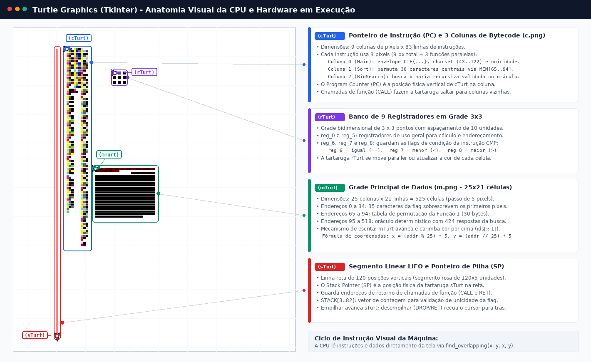

# Google CTF 2023 - Turtle (Reverse Engineering)

Write-up e reprodução do desafio **Turtle**, categoria Reverse Engineering do Google CTF 2023, desenvolvido como avaliação (E3) da disciplina **Segurança Cibernética (CCO-04.2.01)**, PPGCC, UFSCar.

## Membros do grupo
- Bruno Camargo Ribeiro
- Bruno Hiroki Nagao Anhaia
- Cilene Renata Real
- Emerson Hermann Lira dos Santos
- Gabriel Alves Moreira
- Jonathan Choy Rivera
- Stephanie Maria Braga
- Thayná Marostica Machado da Silva
---

## 1. Identificação do desafio e objetivo

Ao executar o arquivo turt.py fornecido, o programa lê um arquivo de "código" disfarçado ou gerado como imagem (c.png). O comportamento visual da tartaruga na tela representa a execução de instruções de uma máquina virtual (VM). Cada movimento ou estado da tartaruga corresponde a uma operação específica na memória ou nos registradores dessa arquitetura fictícia.

O desafio **Turtle** entrega três arquivos originais:
- `turt.py`: um script em Python que utiliza a biblioteca gráfica **Turtle** e a tela de desenho (canvas) do Tkinter de um modo incomum, onde a tartaruga atua diretamente como uma **CPU**.
- `c.png`: uma imagem de **9 x 83 pixels** que codifica o **código** do programa, onde cada trinca de pixels em uma linha representa uma instrução.
- `m.png`: uma imagem de **25 x 21 pixels** que codifica a **memória inicial** da máquina, contendo a tabela de permutação e os resultados esperados das comparações.

### 1.1 Contexto e mecânica central

Em competições de segurança, este tipo de desafio é conhecido como um **crackme**: um programa criado de propósito como um quebra-cabeça. Ele recebe uma senha ou chave secreta (chamada de *flag*) e cabe a quem analisa descobrir a entrada correta investigando a lógica interna do executável, sem ter acesso ao código-fonte em linguagem de alto nível.

Muitos desafios de engenharia reversa usam máquinas virtuais (VMs proprietárias). Neles, o programa roda sobre um processador simulado em software. Em qualquer processador, uma instrução é dividida em duas partes básicas:
- O **opcode** (*operation code*, código de operação): representa a ação a ser executada, como somar, copiar ou comparar (o verbo da instrução).
- Os **operandos**: indicam sobre quais dados a ação atua, como o registrador que receberá o valor ou o número a ser somado (os objetos da instrução).

Normalmente, opcodes e operandos ficam guardados como vetores de bytes na memória RAM. No **Turtle**, código, dados e representação visual se fundem no mesmo espaço gráfico:

```
                  ┌────────────────────────────────────────┐
                  │          Canvas Tkinter (GUI)          │
                  │                                        │
┌──────────────┐  │  ┌──────────┐  ┌─────────┐  ┌───────┐  │
│    c.png     │──┼─►│  cTurt   │  │  mTurt  │  │ rTurt │  │
│ (Instruções) │  │  │(Programa)│  │(Memória)│  │(Regs) │  │
└──────────────┘  │  └──────────┘  └─────────┘  └───────┘  │
                  │       ▲             ▲           ▲      │
┌──────────────┐  │       │             │           │      │
│    m.png     │──┼───────┴─────────────┼───────────┘      │
│(Memória/Tab) │  │                     ▼                  │
└──────────────┘  │               ┌──────────┐             │
                  │               │  sTurt   │             │
                  │               │ (Pilha)  │             │
                  │               └──────────┘             │
                  └────────────────────────────────────────┘
```

**A ideia central:** o arquivo `turt.py` não é a lógica do desafio em si, mas sim o **hardware** (a CPU). O programa real está gravado como **cores de pixels** dentro de `c.png`. A tartaruga percorre esses pixels, interpreta cada trinca como uma instrução (opcode mais dois operandos) e executa a operação.

A entrada do usuário (uma cadeia de 35 caracteres) é desenhada pelo script `turt.py` por cima da área inicial da memória visual no canvas. O programa percorre as instruções e, se todas as verificações forem satisfeitas, emite `"correct flag!"` (instrução `WIN`). Se qualquer verificação falhar, emite `"wrong flag :C"` (instrução `LOSE`) e encerra.

**Objetivo:** descobrir qual sequência de 35 caracteres faz o programa imprimir `"correct flag!"` em vez de `"wrong flag :C"`.

---

## 2. A arquitetura (ISA) - visão geral

### 2.1 As 4 tartarugas (a arquitetura da máquina)

O interpretador `turt.py` cria 4 tartarugas com papéis distintos, distribuídas espacialmente no canvas:

```
  Y (Canvas)
  ▲
  │   [cTurt: Código]          [sTurt: Pilha Linear]
  │   Lê c.png (9x83 px)       Segmento de 120 passos
  │   Passo: 5 px/instrução    SP desloca cursor para frente/trás
  │
  │   [mTurt: Memória 2D]      [rTurt: Registradores 3x3]
  │   Lê m.png (25x21 px)      9 células com espaçamento de 10 px
  │   Célula a: (a%25, a//25)  reg_0..reg_5 (dados), reg_6..8 (flags)
  └─────────────────────────────────────────────────────────────► X (Canvas)
```

| Tartaruga | Papel na CPU | Detalhes de funcionamento |
|---|---|---|
| **C** (`cTurt`) | Ponteiro de instrução (*Program Counter* ou PC) | Percorre `c.png` (9 x 83 pixels). Cada instrução tem 3 pixels de largura. Como a largura total é 9, a imagem acomoda 3 colunas de funções independentes. |
| **M** (`mTurt`) | Memória principal de dados | Grade bidimensional de 25 x 21 = 525 células, com passo de 5 pixels. O endereço `a` fica em $x = (a \bmod 25) \times 5$ e $y = (\lfloor a / 25 \rfloor) \times 5$. A flag testada sobrescreve as primeiras 35 células. |
| **S** (`sTurt`) | Pilha de execução (*stack*) | Opera em uma linha reta de 120 posições. Uma pilha segue o modelo LIFO (*Last In, First Out*), onde o último dado inserido é o primeiro a sair. O ponteiro de pilha (`SP`, de *Stack Pointer*) é a posição física da tartaruga nessa reta. |
| **R** (`rTurt`) | Registradores de uso geral | Grade de 3 x 3 células com 9 registradores (`reg_0` a `reg_8`). Registradores são memórias ultra-rápidas usadas para cálculos temporários. `reg_6`, `reg_7` e `reg_8` guardam as flags de comparação (igual, menor e maior). |

### 2.2 Anatomia visual do hardware em execução

A imagem a seguir apresenta a captura do canvas gráfico do Tkinter durante a execução da CPU Turtle com as quatro tartarugas e os módulos de dados carregados:



*Figura 1 — Anatomia visual e mapeamento dos módulos da CPU Turtle em execução. Fonte: Próprio autor, via script de renderização com auxílio de IA generativa.*

Para gerar ou atualizar essa imagem a qualquer momento diretamente a partir dos arquivos do desafio, execute o comando abaixo na raiz do repositório:

```bash
python3 solver/generate_hardware.py
```

Na área do canvas à esquerda, as quatro tartarugas ativas aparecem identificadas exclusivamente pelos nomes curtos `(cTurt)`, `(rTurt)`, `(mTurt)` e `(sTurt)`, posicionadas em áreas livres para não sobrepor nenhum traço ou pixel do circuito:

1. **Faixa de Código (`c.png` / `(cTurt)` - Program Counter):**
   - Faixa vertical contendo 9 colunas de pixels de largura por 83 linhas de instruções.
   - Cada instrução ocupa uma trinca de pixels horizontais (opcode, destino e fonte). Como a imagem tem 9 pixels de largura, ela abriga 3 colunas de funções que rodam de forma independente: Coluna 0 (Main), Coluna 1 (Sort) e Coluna 2 (BinSearch).
   - A tartaruga `(cTurt)` atua como o **Program Counter (PC)**: sua coordenada vertical indica a linha da instrução atual. Em chamadas de sub-rotina (`CALL`), ela salta lateralmente para a coluna da função chamada.

2. **Banco de Registradores (`(rTurt)`):**
   - Os registradores são posições de memória de trabalho imediato da CPU, permitindo cálculos e comparações rápidas.
   - O hardware organiza 9 registradores (`reg_0` a `reg_8`) em uma grade de 3 x 3 pontos com espaçamento regular de 10 unidades.
   - As posições `reg_0` a `reg_5` guardam dados e variáveis temporárias. As posições `reg_6`, `reg_7` e `reg_8` registram as flags de condição da instrução `CMP`, indicando respectivamente se o primeiro operando é igual (`==`), menor (`<`) ou maior (`>`) que o segundo.

3. **Grade Principal de Memória 2D (`m.png` / `(mTurt)`):**
   - Matriz bidimensional de 25 colunas por 21 linhas, totalizando 525 células de dados.
   - Os endereços de 0 a 34 recebem os valores ASCII da flag informada pelo usuário, desenhados por cima da imagem inicial.
   - Os endereços de 65 a 94 contêm a tabela de permutação fixa da Função 1.
   - Os endereços de 95 a 518 contêm o oráculo com as 424 respostas esperadas da busca binária recursiva.
   - A tartaruga `(mTurt)` caminha até a coordenada correspondente para ler a cor existente ou carimbar uma nova cor sobre a posição.

4. **Trilho Linear da Pilha (`(sTurt)` - Stack Pointer):**
   - Segmento de reta vertical com 120 posições.
   - A pilha funciona sob o princípio LIFO (*Last In, First Out*), análogo a uma pilha de pratos onde o último dado empilhado é o primeiro a ser desempilhado.
   - A tartaruga `(sTurt)` representa o **Stack Pointer (SP)**: ela avança para frente ao empilhar endereços de retorno em instruções `CALL` e recua em instruções `RET` e `DROP`. Entre os endereços 3 e 82 da pilha, o programa cria uma tabela de frequência para atestar que os 30 caracteres centrais da flag são todos diferentes entre si.

5. **Ciclo de Instrução Visual:**
   - A máquina consulta o canvas usando a função `find_overlapping(x, y, x, y)`. O movimento das quatro tartarugas coordena todo o fluxo de busca, decodificação, leitura de operandos e escrita dos resultados.

### 2.3 O mecanismo visual: `find_overlapping` e precedência de camadas

A máquina não lê valores de uma matriz convencional em memória RAM. A leitura é feita perguntando qual cor está desenhada no canvas naquele ponto:

```python
def getColor(turt):
    x = int(turt.pos()[0])
    y = -int(turt.pos()[1])
    canvas = turtle.getcanvas()
    ids = canvas.find_overlapping(x, y, x, y)
    for index in ids[::-1]:
        color = canvas.itemcget(index, "fill")
        if color and color[0] == "#":
            return hexToRgb(color)
    return (255, 255, 255)
```

O método `find_overlapping(x, y, x, y)` retorna todos os elementos gráficos que tocam a coordenada $(x, y)$, ordenados do mais antigo (fundo) até o mais recente (topo). Ao usar `ids[::-1]`, o código lê a cor do **último elemento desenhado**.

Esse detalhe governa o ciclo de leitura e escrita da memória:
1. Primeiro, `turt.py` desenha a imagem `m.png` inteira no canvas.
2. Em seguida, desenha os caracteres da flag informada pelo usuário nas primeiras 35 posições.
3. Como os traços da flag foram desenhados depois, `getColor` lê as letras digitadas e não os pixels originais de `m.png` nas posições 0 a 34.
4. Quando o programa precisa alterar o valor de uma célula durante a execução (`writeM`), a tartaruga caminha até a célula e faz um traço de comprimento zero com a caneta abaixada (`pendown()` e `forward(0)`). Isso cria um ponto novo por cima do anterior, atualizando o valor daquela posição.

### 2.4 Como uma instrução é codificada

Cada instrução ocupa **3 pixels em sequência na mesma linha** de `c.png`:
- `color0`: define a operação a executar (opcode) e traz as sinalizações (*flags*) que dizem como ler os operandos.
- `color1`: define o primeiro operando (geralmente o destino).
- `color2`: define o segundo operando (geralmente a fonte).

Os 2 bits menos significativos de cada canal de cor do pixel `color0` indicam o modo de endereçamento dos operandos:

```
color0:
  Canal R: [ Opcode R (6 bits) ] [ isR2 (bit 1) ] [ isR1 (bit 0) ]  -> Registrador direto
  Canal G: [ Opcode G (6 bits) ] [ isP2 (bit 1) ] [ isP1 (bit 0) ]  -> Ponteiro (Memória ou Pilha)
  Canal B: [ Opcode B (6 bits) ] [ isC2 (bit 1) ] [ isC1 (bit 0) ]  -> Constante numérica
```

* **Constantes numéricas (24 bits):** cada pixel reúne três valores de 0 a 255 (Vermelho $B_0$, Verde $B_1$ e Azul $B_2$). O valor numérico é calculado na convenção **little-endian** (o byte de menor peso vem primeiro):
  $$
  \text{Const} = B_0 + (B_1 \ll 8) + (B_2 \ll 16) \pmod{2^{24}}
  $$
  Esse número é interpretado **com sinal**: se for maior ou igual à metade do limite máximo ($8.388.608$), ele representa um número negativo ($\text{Const} - 2^{24}$). Isso permite fazer saltos relativos para trás, viabilizando laços de repetição (loops).
* **Registradores:** o índice do registrador de 0 a 8 é obtido por `(byte - 20) // 40`.
* **Ponteiros (acesso indireto):** o endereço final é obtido por `reg_A + reg_B + offset`. Se a flag `isR` estiver ligada junto com `isP`, o acesso ocorre na **pilha** (`STACK[...]`). Caso contrário, ocorre na **memória global** (`MEM[...]`).

### 2.5 A tabela de opcodes: processo de redescoberta

O arquivo `turt.py` não traz comentários indicando qual cor representa cada comando. Para descobrir a semântica da máquina, foi necessário inspecionar a função `run()` e analisar o que o código executa em cada bloco condicional. A partir desse comportamento prático, demos nomes aos comandos por analogia com instruções assembly tradicionais.

**Passo 1: Isolar a estrutura de decisão.** A função `run()` lê a cor do primeiro pixel e aplica uma máscara de bits:

```python
color0 = getColor(cTurt)
cmpcolor = (color0[0] & 0xfc, color0[1] & 0xfc, color0[2] & 0xfc)
```

A cor mascarada (`cmpcolor`) isola os 6 bits superiores de cada canal RGB. Os 2 bits inferiores são descartados nesse momento para serem usados como flags de operando.

**Passo 2: Nomear cada operação pelo comportamento.** Para cada bloco condicional de `cmpcolor`, observamos a ação executada:

| Cor mascarada | Ação no código | Mnemônico escolhido | O que faz |
|---|---|---|---|
| `(0, 252, 0)` | `print("correct flag!"); exit(0)` | **WIN / success** | Finaliza a execução confirmando a flag correta. |
| `(252, 0, 0)` | `print("wrong flag :C"); exit(0)` | **LOSE / fail** | Finaliza a execução indicando flag incorreta. |
| `(204, 204, 252)` | `sTurt.forward(readC(color1) * 5)` | **DROP / sp_adjust** | Ajusta o ponteiro da pilha (`SP += val`). |
| `(220, 252, 0)` | `write(color1, val2, ...)` | **MOV** | Copia o valor da fonte diretamente no destino (`dst = src`). |
| `(252, 188, 0)` | `write(color1, readPA(color2, isC2), ...)` | **LEA** | Calcula o endereço da fonte e grava no destino (`dst = addr`). |
| `(64, 224, 208)` | `write(color1, val1 + val2, ...)` | **ADD** | Realiza a soma de dois valores (`dst = dst + src`). |
| `(156, 224, 188)` | `write(color1, val1 - val2, ...)` | **SUB** | Realiza a subtração de dois valores (`dst = dst - src`). |
| `(100, 148, 236)` | `write(color1, val1 >> val2, ...)` | **SHR** | Desloca bits para a direita (`dst = dst >> src`). |
| `(252, 124, 80)` | atualiza `reg_6` (igual), `reg_7` (menor) e `reg_8` (maior) | **CMP** | Compara dois valores e atualiza os três registradores de flag. |
| `(220, 48, 96)` | move `cTurt` para frente ou para trás na vertical | **JUMP / jcc** | Salto condicional relativo na mesma coluna de código. |
| `(252, 0, 252)` | grava retorno na pilha e salta para outra coluna | **CALL** | Chama outra função guardando a posição de retorno. |
| `(128, 0, 128)` | recupera coordenadas da pilha e retorna | **RET** | Retorna da chamada de função para o chamador original. |

A distinção entre `MOV` e `LEA` fica evidente na linha de leitura da fonte:

```python
if cmpcolor == (252, 188, 0):
    val2 = readPA(color2, isC2)             # calcula o endereço efetivo (LEA)
else:
    val2 = read(color2, isR2, isP2, isC2)   # lê o valor guardado no endereço (MOV)
```

Essa é a exata diferença entre ler o conteúdo de um endereço (`MOV`) e capturar o próprio endereço calculado (`LEA`).

**Passo 3:Decodificar as flags dos operandos.** Os 2 bits inferiores de cada canal de `color0` informam o formato dos operandos:

```python
isR1 = color0[0] & 1 != 0    # bit 0 de R: primeiro operando é registrador?
isP1 = color0[1] & 1 != 0    # bit 0 de G: primeiro operando é ponteiro?
isC1 = color0[2] & 1 != 0    # bit 0 de B: primeiro operando é constante?
isR2 = color0[0] & 2 != 0    # bit 1 de R: segundo operando é registrador?
isP2 = color0[1] & 2 != 0    # bit 1 de G: segundo operando é ponteiro?
isC2 = color0[2] & 2 != 0    # bit 1 de B: segundo operando é constante?
```

**Passo 4: O salto condicional e o salto incondicional.** Na instrução de salto `(220, 48, 96)`, os bits de `color0` selecionam quais condições disparam o deslocamento:

```python
e = readRVal(6)   # resultado igual da última comparação
l = readRVal(7)   # resultado menor
g = readRVal(8)   # resultado maior

if (color0[0] & 1 != 0 and e) or (color0[1] & 1 != 0 and not e) or \
   (color0[0] & 2 != 0 and l) or (color0[1] & 2 != 0 and g):
    # executa o salto somando o deslocamento relativo
```

O canal R bit 0 ativa "se igual", G bit 0 ativa "se diferente", R bit 1 ativa "se menor" e G bit 1 ativa "se maior". Se os quatro bits estiverem ligados simultaneamente, a expressão resulta sempre em verdadeiro, criando um **salto incondicional** (`JUMP`).

---

## 3. Engenharia reversa do bytecode (`c.png`)

A imagem `c.png` possui 9 pixels de largura por 83 de altura. Cada instrução utiliza 3 pixels de largura. Isso significa que o programa é composto por 3 colunas paralelas, correspondendo a três funções:

```
Colunas em c.png:
[Coluna 0: Função 0 (Main)]  |  [Coluna 1: Função 1 (Sort)]  |  [Coluna 2: Função 2 (BinSearch)]
```

### 3.1 Função 0 (Main): formato, charset e unicidade

A Função 0 é o ponto de entrada da CPU e executa as seguintes etapas:

**1. Verificação do envelope `CTF{...}`:**
O programa lê os primeiros 4 caracteres e o último caractere da entrada:
```asm
01: MOV reg_2, MEM[0]     ; Lê caractere 0
02: CMP reg_2, 67         ; Compara com 'C' (ASCII 67)
03: JUMP BY 13 IF !=      ; Se diferente, desvia para LOSE
04: MOV reg_2, MEM[1]     ; Compara com 'T' (ASCII 84)
...
10: MOV reg_2, MEM[3]     ; Compara com '{' (ASCII 123)
13: MOV reg_2, MEM[34]    ; Lê caractere 34 (último caractere)
14: CMP reg_2, 125        ; Compara com '}' (ASCII 125)
```

**2. Criação do mapa de contagem:**
Zera um vetor de 80 posições na pilha (`STACK[3..82] = 0`). Esse vetor serve como tabela de frequência para detectar repetições.

**3. Validação do charset:**
Percorre as posições de 4 a 33 (os 30 caracteres do miolo) e testa se cada caractere $c$ está no intervalo:
$$
43 \le c \le 122 \quad (\text{entre '+' e 'z' na tabela ASCII})
$$

**4. Verificação de unicidade:**
Para cada caractere $c$, lê a célula `STACK[c - 43 + 3]`. Se o valor for diferente de zero, aciona `LOSE`. Se for zero, grava o valor `65025`. Isso prova que **todos os 30 caracteres do miolo precisam ser estritamente distintos**.

**5. Encadeamento:**
Chama a Função 1 (`CALL RIGHT 3 UP 54`) para reordenar os caracteres. Depois, percorre em loop todos os valores ASCII de 43 a 122 chamando a Função 2 (busca binária). Se nenhuma comparação falhar, alcança a linha 68 e aciona `WIN`.

### 3.2 Função 1 (Sort): permutação por tabela estática

A Função 1 reordena os 30 caracteres internos da flag usando uma tabela gravada nos pixels 65 a 94 de `m.png`:

```asm
00: MOV reg_2, 4               ; Índice inicial da flag original (MEM[4])
02: MOV STACK[-3], 0           ; Iterador i = 0
04: CMP reg_2, 29              ; Loop de i=0 até i=29
...
11: MOV reg_4, 65              ; Base da tabela de permutação (MEM[65])
12: MOV reg_2, MEM[reg_2+reg_4]; dest = MEM[65 + i] (posição de destino)
13: MOV reg_5, MEM[reg_5]      ; char = flag[i]      (caractere original)
15: MOV MEM[reg_2+reg_4], reg_5; MEM[35 + dest] = char (copia para buffer de saída)
16: ADD STACK[-3], 1           ; i++
17: JUMP BY -14                ; Volta ao início do laço
18: RETURN THISFUN 18          ; Retorna ao Main
```

O efeito desse laço é reordenar os 30 bytes da flag em `MEM[35..64]` segundo a tabela fixa:
$$
\text{MEM}[35 + \text{perm}[i]] = \text{flag}[4 + i]
$$

### 3.3 Função 2 (BinSearch): busca binária recursiva com oráculo

A Função 2 implementa uma busca binária sobre o buffer permutado (`MEM[35..64]`). O endereço de memória `MEM[519]` armazena um contador global de comparações realizadas (`cmp_count`):

```asm
07: MOV reg_2, MEM[519]        ; Lê contador de comparações
08: CMP reg_2, 424             ; Limite esperado de 424 passos
...
11: CMP STACK[1], 0            ; flaglen == 0 ? (partição vazia)
14: LEA reg_5, reg_2+1         ; cmp_count++
15: MOV MEM[519], reg_5
17: MOV reg_2, MEM[reg_2+95]   ; Lê resultado esperado em MEM[95 + cmp_count]
18: CMP reg_2, 4               ; Se partição vazia, esperado deve ser 4
...
23: SHR reg_2, 1               ; mid = (flaglen - 1) / 2
28: MOV reg_2, MEM[reg_2]      ; elemento = buffer[mid]
29: CMP STACK[2], reg_2        ; Compara o valor buscado (tgt) com buffer[mid]
```

Para cada iteração de teste:
- Se `tgt < buffer[mid]`: o valor esperado em `MEM[95 + cmp_count]` precisa ser **1**. Faz chamada recursiva na metade esquerda.
- Se `tgt > buffer[mid]`: o valor esperado precisa ser **2**. Faz chamada recursiva na metade direita.
- Se `tgt == buffer[mid]`: o valor esperado precisa ser **3**. O caractere foi localizado no vetor.
- Se a partição atingir tamanho zero (`flaglen == 0`): o valor esperado precisa ser **4**. O caractere não pertence à flag.

Se qualquer comparação divergir do valor tabelado, o fluxo desvia para `LOSE`.

A sequência de 424 valores gravada em `m.png` (posições 95 a 518) atua como um **oráculo**: ela traz as respostas corretas de cada comparação da busca binária, permitindo deduzir a posição de cada caractere sem precisar adivinhar nada.

---

## 4. Reconstrução da flag e resolução matemática

### 4.1 A sequência de comparações em `m.png`

O Main testa todos os 80 caracteres do intervalo ASCII $[43, 122]$ em ordem crescente. Como os 30 caracteres da flag já foram colocados em ordem crescente no buffer `MEM[35..64]`, cada busca binária traça um caminho previsível na árvore de partições.

A imagem `m.png` traz dois blocos essenciais:
- **Bytes 65 a 94 (30 valores):** a tabela de permutação da Função 1.
- **Bytes 95 a 518 (424 valores):** a sequência dos resultados esperados das comparações.

### 4.2 Dedução dos caracteres ordenados

Ao reproduzir os passos da busca binária guiando-se pelas respostas gravadas em `m.png`, sempre que encontramos o resultado `3` sabemos com certeza qual caractere ocupa aquela posição do vetor ordenado:

```python
mid = (flaglen - 1) // 2
if cmp_result == 1:
    flaglen = mid                # Busca à esquerda
elif cmp_result == 2:
    left += mid + 1              # Busca à direita
    flaglen -= mid + 1
elif cmp_result == 3:
    sorted_flag[left + mid] = chr(tgt)  # Caractere localizado
    break
elif cmp_result == 4:
    break                        # Caractere não faz parte da flag
```

Ao rodar esse processo para todos os valores de `tgt` entre 43 e 122, obtemos as 30 letras na ordem classificada:

$$
\text{sorted\_flag} = \texttt{"+-./01357:;AELTUWY\_adehilnrstw"}
$$

### 4.3 Inversão da permutação e recomposição final

A tabela de permutação extraída de `MEM[65..94]` é:

```python
perm = [23, 14,  7, 18, 12,  1, 28, 15, 26,  0,
         5, 21, 27,  3, 11, 24, 13,  2,  8, 22,
         6, 10, 29, 19, 17,  9, 20,  4, 16, 25]
```

Como a Função 1 gravou o caractere de posição original $i$ na posição `perm[i]` do buffer ordenado, para recuperar a flag original basta consultar o caractere ordenado correspondente:


$$
\text{flag\_original}[i] = \text{sorted\_flag}[\text{perm}[i]]
$$

Mapeando cada índice:

| Índice original | Posição ordenada (`perm[i]`) | Caractere |
|---|---|---|
| 0 | 23 | `i` |
| 1 | 14 | `T` |
| 2 | 7 | `5` |
| 3 | 18 | `_` |
| 4 | 12 | `E` |
| 5 | 1 | `-` |
| 6 | 28 | `t` |
| 7 | 15 | `U` |
| 8 | 26 | `r` |
| 9 | 0 | `+` |
| 10 | 5 | `1` |
| 11 | 21 | `e` |
| 12 | 27 | `s` |
| 13 | 3 | `/` |
| 14 | 11 | `A` |
| 15 | 24 | `l` |
| 16 | 13 | `L` |
| 17 | 2 | `.` |
| 18 | 8 | `7` |
| 19 | 22 | `h` |
| 20 | 6 | `3` |
| 21 | 10 | `;` |
| 22 | 29 | `w` |
| 23 | 19 | `a` |
| 24 | 17 | `Y` |
| 25 | 9 | `:` |
| 26 | 20 | `d` |
| 27 | 4 | `0` |
| 28 | 16 | `W` |
| 29 | 25 | `n` |

Unindo o miolo ao envelope `CTF{...}`:

$$
\mathbf{CTF\{iT5\_E-tUr+1es/AlL.7h3\text{;}waY\text{:}d0Wn\}}
$$

---

## 5. Teoria necessária

**Codificação de instruções em pixels:** 

O código usa as cores dos pixels para representar instruções. Parte dos bits informa o que fazer (a operação) e outra parte informa como utilizar os dados (os operandos). Isso é semelhante ao funcionamento das instruções de um processador real.

**Busca binária como oráculo determinístico:**

A busca binária não é usada apenas para localizar um valor. Neste caso, os resultados das comparações ajudam a descobrir quais caracteres fazem parte da flag e suas respectivas posições. A cada comparação, metade das possibilidades é eliminada, tornando a busca mais eficiente. Em vez de usar o algoritmo apenas para buscar dados em um array, usamos os resultados das comparações já gravadas para identificar quais caracteres pertencem à flag e onde se encontram. Cada comparação reduz o espaço pela metade, rodando em tempo linear $\mathcal{O}(|\Sigma| \cdot \log N)$, onde $|\Sigma|$ é o alfabeto testado e $N$ é o tamanho do vetor.

**Permutações:**

O array define uma nova ordem para as 30 posições. Essa ordem funciona como uma chave de transposição, pois reorganiza os caracteres e pode ser desfeita para recuperar a sequência original.

**Linguagens esotéricas bidimensionais:**

O programa é organizado em uma estrutura visual, na qual a posição dos elementos influencia a execução. Assim como em linguagens como Piet e Befunge, as instruções e os caminhos que o programa percorre são definidos pelas posições em uma matriz.

---

## 6. Ambiente, dependências e decisão de reprodutibilidade

**Não usamos Tkinter, nem Xvfb, nem qualquer ambiente gráfico.**

O script original `turt.py` depende da biblioteca gráfica `turtle`, que por sua vez exige uma janela do Tkinter aberta. Em servidores e contêineres sem monitor, rodar o script original exigiria instalar e configurar o `Xvfb` (*X Virtual Framebuffer*).

Para eliminar esse atrito e permitir testes instantâneos, desenvolvemos um **shim headless** (`solver/headless_turtle.py`): ele reimplementa estritamente o subconjunto da API de `turtle.Turtle()` utilizado pelo desafio (`forward`, `back`, `left`, `right`, `penup`, `pendown`, `pencolor`, `pos`, `speed`, `pensize`) usando um dicionário em memória que mapeia coordenadas $(x, y)$ para cores, permitindo executar o arquivo original `turt.py` com apenas 3 linhas adaptadas (`solver/turt_headless.py`), mantendo 100% da lógica original.

### 6.1 Verificação de integridade dos arquivos originais

Os arquivos originais guardados em `challenge/` foram validados contra o commit oficial `1655538e...`:

| Arquivo | Tamanho | SHA-256 |
|---|---|---|
| `challenge/turt.py` | 8.393 bytes | `e9ba509e45f76fb591c59dbb23e41940159ad55a1282637cdde542181e981af4` |
| `challenge/c.png` | 972 bytes | `93fc64039bfabdcb63ae2d2fb0b9d971f3d8611e1d592cf136b4d348cc33e76f` |
| `challenge/m.png` | 365 bytes | `362e0b5c82b331df38ea0560c9469da3ca603490924a01ab84687f347920e518` |

---

## 7. Estrutura do repositório

```
googlectf2023-turtle-writeup/
├── README.md                 # Relatório técnico completo da solução
├── hardware.png              # Diagrama e anatomia visual do hardware em execução
├── .gitignore                # Exclusões de ambiente virtual e arquivos temporários
│
├── challenge/                # Arquivos ORIGINAIS do desafio (sem qualquer alteração)
│   ├── turt.py               # Interpretador da CPU Turtle (GUI original)
│   ├── c.png                 # Bytecode das três funções (9x83 px)
│   └── m.png                 # Memória inicial, tabela e comparações (25x21 px)
│
└── solver/                   # Códigos de análise e solução
    ├── headless_turtle.py    # Shim que substitui o Tkinter por dicionário em memória
    ├── turt_headless.py      # Execução fiel de turt.py sem interface gráfica
    ├── resolve_turtle.py     # Script principal: extrai arrays, reconstrói e valida
    ├── generate_hardware.py  # Script que renderiza a imagem hardware.png
    └── requirements.txt      # Dependência externa (Pillow)
```

---

## 8. Origem dos artefatos e adaptações do grupo

- **`challenge/turt.py`, `challenge/c.png`, `challenge/m.png`:** baixados diretamente do repositório oficial do Google CTF 2023, mantidos intactos sem alteração de nenhum byte.
- **`solver/headless_turtle.py`:** desenvolvido do zero pelo grupo para emular as chamadas da tartaruga com um dicionário de coordenadas em memória, cobrindo o subconjunto da API gráfica usado no desafio (`forward`, `back`, `left`, `right`, `penup`, `pendown`, `pencolor`, `pos`, `speed`, `pensize`).
- **`solver/turt_headless.py`:** cópia fiel do interpretador original, trazendo apenas três adaptações documentadas no topo do arquivo: troca do módulo gráfico pelo shim, leitura de cor direta do dicionário e encapsulamento em função reutilizável.
- **`solver/resolve_turtle.py`:** script principal de solução, que extrai a tabela de permutação, simula a busca binária sobre os dados de `m.png`, reconstrói a flag e a valida executando a VM de ponta a ponta.
- **`solver/generate_hardware.py`:** script construído pelo grupo para renderizar e salvar o estado visual fiel da CPU em `hardware.png`.

---

## 9. Como rodar (instruções de ponta a ponta)

### 9.1 Linux / macOS

```bash
# 1. Entrar na pasta solver
cd solver

# 2. Criar e ativar o ambiente virtual
python3 -m venv venv
source venv/bin/activate

# 3. Instalar dependências
pip install -r requirements.txt

# 4. Executar o solver principal e a validação de ponta a ponta
python3 resolve_turtle.py
```

### 9.2 Windows (PowerShell)

```powershell
cd solver
python -m venv venv
.\venv\Scripts\Activate.ps1
pip install -r requirements.txt

python resolve_turtle.py
```

### 9.3 Saída esperada da execução

```text
======================================================================
PASSO 1 — Carregando a memória (m.png) com um placeholder
======================================================================
Memória carregada. Placeholder de 35 caracteres em uso.

======================================================================
PASSO 2 — Extraindo os dois arrays gravados na memória
======================================================================
Array de reordenação (30 posições):
  [23, 14, 7, 18, 12, 1, 28, 15, 26, 0, 5, 21, 27, 3, 11, 24, 13, 2, 8, 22, 6, 10, 29, 19, 17, 9, 20, 4, 16, 25]
  É permutação válida de 0..29? True
Array de resultados da busca (424 entradas brutas).

======================================================================
PASSO 3 — Reconstruindo a flag
======================================================================
Flag reconstruída: CTF{iT5_E-tUr+1es/AlL.7h3;waY:d0Wn}
Tamanho: 35 (esperado: 35)

======================================================================
PASSO 4 — Validação final: rodando a VM completa, do zero
======================================================================
Resultado da execução completa: correct
Tempo: 0.11s

[SUCESSO] A flag reconstruída foi ACEITA pelo programa original,
rodando de ponta a ponta.
```

---

## 10. Evidência de reprodução

Os pontos que comprovam a correção da solução:
- O array de reordenação extraído é uma bijeção matemática válida de 0 a 29 (conferido via `sorted(array) == list(range(30))`).
- A flag recuperada possui exatamente 35 caracteres, respeitando o envelope `CTF{...}` exigido pela Função 0.
- A validação no Passo 4 executa a VM original instrução por instrução e retorna `"correct"` em cerca de 0,11 segundos, comprovando a aceitação total da entrada.

---

## 11. Contribuições próprias do grupo

- **Emulador headless com shim de canvas:** em vez de depender de interfaces gráficas pesadas ou do `Xvfb`, construímos uma camada que roda o código original da competição sem alterar a lógica de CPU da máquina.
- **Redescoberta investigativa da ISA:** processo documentado passo a passo a partir da leitura do código, provando a dedução independente dos 12 opcodes e dos modos de endereçamento.
- **Solução direta por inversão de restrições:** reconstrução da flag guiando-se pelas 424 respostas da busca binária e inversão da permutação estática, dispensando força bruta.

---

## 12. Referências

- GOOGLE. **Google CTF 2023 Quals Repository**. Desafio rev-turtle, commit `1655538e8c8b41451d39f670ef15a5af22979ca9`. Disponível em: <https://github.com/google/google-ctf/tree/master/2023/quals/rev-turtle>. Acesso em: 27 set. 2026.
- CTFTIME. **Google Capture The Flag 2023 (Quals), Task: Turtle**. Disponível em: <https://ctftime.org/task/25686>. Acesso em: 27 set. 2026.
- YEN, B. **GoogleCTF 2023 Writeup, Turtle Section**. Disponível em: <https://ctftime.org/writeup/37339>. Acesso em: 27 set. 2026.
- PYTHON SOFTWARE FOUNDATION. **Turtle Graphics Documentation (Python 3.13)**. Disponível em: <https://docs.python.org/3/library/turtle.html>. Acesso em: 27 set. 2026.
- TKINTER AUTHORS. **Tkinter Canvas Widget Documentation**. Disponível em: <https://tkdocs.com/shipman/canvas.html>. Acesso em: 27 set. 2026.

## 13. Apresentação em slides

- https://canva.link/ih26ipnpjorxrtq
